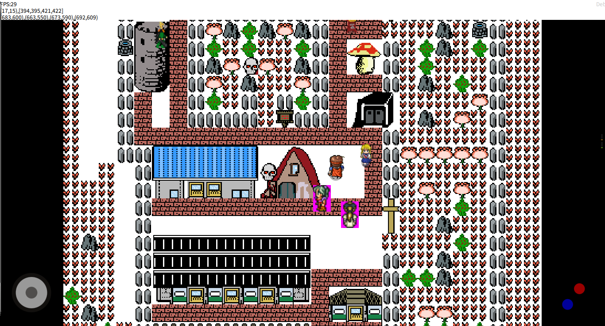

# MakerFrame框架_跨平台游戏引擎-RPG+ARPG+策略战棋+即时战略+文字等

#### 介绍

* 鹰歌MakerFrame框架 是一款由 Qt/QML/JAVA 构建的供二次开发的软件/游戏的制作及运行的开放式跨平台框架，它可以运行在Windows、Android、iOS、macOS、Linux（Ubuntu、包括国产化）等主流平台上，并提供了屏幕自适应、网络、热更新、数据库、文件管理、媒体播放器、浏览器内核等众多功能和扩展，可以用来开发多种游戏、引擎及软件等；
* 鹰歌游戏引擎 是基于 鹰歌MakerFrame框架 开发的一套开放式 RPG/ARPG/策略与战旗/文字AVG/放置类 等游戏制作引擎和运行环境，主要由QML/JS编写，适用于开发游戏和插件，可使用视图编程、代码或两者结合的方式来制作；
* QQ群：654876441

#### 作者的话

* 鹰歌MakerFrame框架和游戏引擎 的完成度还可以（除了UI，由于时间精力经济问题），框架已经完成，游戏引擎目前完成了RPG/ARPG/策略与战旗/文字AVG/放置类，功能、扩展、自由度都非常不错，还提供了完整可扩展的视图编程和视图编辑器，很多细节和功能仍然正在完善和优化，同时也希望有人能参与一起完善框架和引擎。
* 目前用鹰歌有三种方式来制作游戏（其实并不局限于这三种方式，因为它的用法是针对每种类型每个对象都可以不同，比如你某个道具可以用脚本，另一个道具可以用视图编辑，技能之间也可以不同，自由度非常高）：
  1、纯视图编辑，这种是最简单，最快速的方法，缺点是功能固化，模式单一；
  2、纯写脚本，引擎只需会JavaScript（有一点QML基础更好）就行，优点是开放度、自由度、功能性非常高，技术上不封顶，缺点是稍微稍难一点。
  3、视图编辑+脚本混合，我非常推荐的一种方法，可以逐渐深入引擎并编写各种功能和玩法，方法是某个对象（道具、技能或人物等）可以用视图编辑生成一个代码模板，然后在此基础上修改，但注意某个视图编辑对象一旦重新编辑编译，会替换你对应改好的脚本（其实生成后不用再动视图编辑，而且对象粒度很小）。

#### 安装教程

1. Windows版本：分别解压 Qt_v5.15.10_win_x64、MakerFrame_鹰歌框架引擎_win_x64_vXXX 或 MakerFrame_鹰歌框架引擎_win_x86_vXXX，双击“_运行鹰歌.bat”。
2. 安卓：安装运行 MakerFrame_鹰歌框架引擎_xxx_armeabi-v7a.apk 或 MakerFrame_鹰歌框架引擎_xxx_arm64-v8a.apk 即可。
3. 苹果IOS、MACOS、Linux（RedHat和Debain及其各种分支和国产化系统、x86、arm架构相关）等：已经适配，但IOS应用市场需要付费，以后再发布。
4. 打开软件后，进入RPGMaker主界面，再点击 示例工程，请等待下载完毕后，点击 开始运行-》运行 就OK了。
5. 各平台软件都是热更新（内核、引擎和Java代码），大部分情况下无需额外操作（服务器带宽较慢，可能升级和下载时间会稍微长一点）。

#### 功能和特色

1.跨平台：框架、编辑器和游戏都可完美运行在win、安卓、macos、ios、linux（包括x86、arm的Ubuntu、国产化统信UOS、树莓派）等平台；
2.可联网：框架有后台服务器和数据库，可做注册登录、聊天、房间、联机对战等功能，且都是跨平台共用的；
3.多种发布形式：能生成对应平台的安装包exe、apk等（可发布在steam、taptap等平台），也可生成框架可载入的游戏资源ROM；资源和代码可原样提供，也可压缩打包，防逆向盗取；ROM可分发到各平台，或上传到官网，用链接、二维码、分享等形式来载入运行）；
4.框架热更新：框架底层采用我编写的升级载入运行器，可对C++编写的库、Java编写的安卓代码、QML编写的编辑器和游戏，无感自动热更新，不用繁琐的下载和重新安装；
5.屏幕自适应：在任何分辨率，各种不同大小的屏幕下有相同的显示效果；提供了不同的方式来应对各种屏幕（比如按比例简单缩放、按固定size显示、按布局方式排列等）；
6.多层次的架构设计，可满足和适应不同技术的玩家（见下面的架构设计）；
7.其他方面/技术：
  采用最流行的 javascript语言 来开发 编辑器、游戏脚本和扩展；js引擎是谷歌v8（非H5），运行效率高；
  能用c++、java（安卓）等本地语言来封装接口给js调用（比如 震动、gps等功能）；
  后端是C++和IOCP高并发模型的服务，已封装常用功能（登录、聊天、群组、帧同步等），可万人同时在线；
  通信协议可支持TCP、UDP和HTTP三种常用协议，可选Websocket等其他扩展协议；
  支持主流的图片、音乐和视频播放；
  安卓内置一个Webview浏览器内核；
  存储/数据库 可采用远程mysql和本地sqlite（提供加密和未加密两种）；
  理论上几乎支持所有2d游戏类型(比如已有的RPG和放置、ARPG、AVG、即时战略、战棋、棋牌等等)的网络和单机游戏，3D的可用QML3D或opengl来自行学习和设计（我对3D不熟悉）；
  集成其他流行库：
    已集成Box2D-qml和Bacon2D库，QML可使用物理引擎来做插件/游戏等；
    已集成qnanopainter库，基于opengl的QPaint方式绘图，绘图效率非常高，qml哪个组件不顺眼完全可以用它来替换；
    已集成TapTap实名认证，可以上架Tap（侠道仙缘已上架到tap和openkylin应用商店）；
    已集成SDL3库（很不错的一款跨平台游戏开发库）；
    已集成SCodes/QZXing库（生成、扫描一维码和二维码）；
    已集成Quazip库（压缩、解压zip文件）；
    已集成SQLITECIPHER库（加密Sqlite）；
    已集成libhv库（非常不错的网络库，可以使用tcp、udp、http、websocket等网络功能和服务；
  以上功能大都已封装为js扩展来进行调用，也可以使用QML插件机制来编写和扩展；

#### 架构设计

1、鹰歌MakerFrame框架 使用Qt（C++）、Java、QML（JavaScript）来构建的（包含跨平台、联网、打包、底层功能等）；
2、鹰歌RPG Maker引擎 基于 鹰歌MakerFrame框架，使用QML来构建游戏制作引擎和运行环境（如RPG的 地图编辑器、角色编辑器、道具编辑器、升级链编辑器、特效编辑器、战斗编辑器、音乐编辑器等）。
3、此框架引擎重点在于打造 手持端（兼容PC、MAC等跨端）和国产化系统 的跨平台游戏框架引擎，专业的还请绕道Unity、虚幻等更好的引擎；
4、此框架适合：
    a、非专业人士；想任意端编写（主要是手机、国产化系统）、任意端运行（Win、安卓、Linux、苹果等）、且可发布在steam、taptap等平台的游戏；
    b、学习Javascript、QML或编写引擎的：鹰歌是个不错的宿主环境，可以在底层或业务层进行任意扩展；
    c、技术爱好者：鹰歌在功能上来说是一款非常丰富的超级APP，它包括了游戏制作、多媒体播放、网络、数据库、浏览器、图形绘制、热更新 等功能，又有跨平台、自适应等特点，很适合用来研究技术；
5、功能分层：
    a、上层（纯视图编辑开发）：道具、战斗人物、技能、战斗脚本使用视图编辑生成，脚本使用纯视图编程来制作，只需设计 剧情、道具、地图、人物、战斗 等等就可以做出游戏，后期还可能做Excel、Json等来设计游戏内容，框架导入来生成游戏；
    b、中层（视图编辑+JS代码）：用JS代码来扩展视图编辑，可以开发和设计更多的内容，比如游戏的算法、界面效果、升级链、道具、人物、登录、联网功能、视图命令 等等；
    c、底层（QML+JS）：用QML/JS语言来扩展界面和功能，也可使用框架提供的Box2D和qnanopainter库，比如制作插件、扩展视图编程、修改引擎和编辑器、甚至可以做其他类型的游戏引擎、编辑器和游戏，还可以做各种类型的软件APP（系统软件、业务软件、播放器、浏览器等）；
    d、内核/扩展层：一般作者我来维护，包括了跨平台、联网基础、资源整合与打包、屏幕自适应、自升级、压缩解压、文件下载、编译打包、平台分发、三方库（Bacon2D、Box2D-qml、qnanopainter、SCodes/QZXing、Quazip、SDL3、libhv、SQLITECIPHER、taptap等）、三方SDK（微信相关、支付等）等系统功能；
6、未来：
    a、RPG Maker完成后，还会继续开发战旗类Maker、AVG Maker、ARPG Maker、卡牌类Maker等（都是我喜欢的游戏类型），希望能有志同道合的朋友一起加入进来~；
    b、优化引擎：引入缓存机制，并将QML中效率不高的图形引擎替换为OpenGL，JS算法替换为C++；
    c、开发3D引擎；

#### 特别鸣谢

    1、荔竹的策划和demo游戏工程；
    2、吾爱的代码版测试、建议和他的游戏工程（已上架Tap应用商店和openKylin应用商店）；
    3、网友（落雪、工作台、落冥迦等）人的参与；
    4、openKylin官方的支持；

#### 参与贡献

1. Fork 本仓库
2. 新建 Feat_xxx 分支
3. 提交代码
4. 新建 Pull Request

#### 特技

1. 使用 Readme\_XXX.md 来支持不同的语言，例如 Readme\_en.md, Readme\_zh.md
2. Gitee 官方博客 [blog.gitee.com](https://blog.gitee.com)
3. 你可以 [https://gitee.com/explore](https://gitee.com/explore) 这个地址来了解 Gitee 上的优秀开源项目
4. [GVP](https://gitee.com/gvp) 全称是 Gitee 最有价值开源项目，是综合评定出的优秀开源项目
5. Gitee 官方提供的使用手册 [https://gitee.com/help](https://gitee.com/help)
6. Gitee 封面人物是一档用来展示 Gitee 会员风采的栏目 [https://gitee.com/gitee-stars/](https://gitee.com/gitee-stars/)

