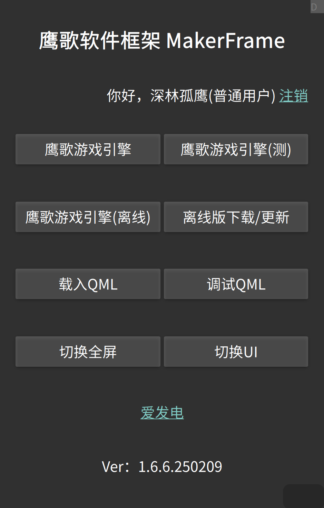

# 前言

&emsp;&emsp;欢迎使用鹰歌框架之鹰歌RPG游戏引擎+Maker，在这里我首先会把你当作一个小白，一步步教你如何用这个应用来最简单、最快速的创作一个RPG游戏。

# 准备

* 一部安卓手机或电脑
* 鹰歌框架软件（安卓或电脑版）
* 细心、耐心和恒心

# 一、安装

&emsp;&emsp;这个我就不多说了，注意的是鹰歌处于快速迭代期，尽量使用最新版来体验最新的功能。另外，除了内核一般很少升级外，引擎大部分都是自己热更新的，不需要你来手动下载更新（很方便吧？）。

# 二、运行

&emsp;&emsp;如果安装成功并运行（界面虽丑但功能强大，不要被外表所欺骗~），会出现第一个界面：鹰歌框架主界面

&emsp;&emsp;小白可以无脑选择第一项：鹰歌RPG引擎。

Tips：

* RPG引擎和Maker其实是框架的一个应用（QML+JS开发），如果是高手可以自己制作引擎或游戏，然后用“载入外部QML文件”来调用；
* 鹰歌RPG引擎 和 鹰歌RPG引擎（内测）是在线版本，需要联网用，鹰歌RPG引擎 是正式版，Bug最少各平台兼容最好，内测版本会有比正式版更多的功能体验，直到测试完毕并做好兼容后才合并到正式版；
* 离线版是无网也可以使用，使用离线版得先点右边的”离线版 下载更新“，离线版可以固定版本号；
* 切换全屏和切换UI试试就知道了；
* 下面的版本号是框架版本号（爱发电点一个？）；

# 三、进入引擎主界面

  

Tips：

* 点击“示例工程”可以下载官方自带Demo工程（有点慢得等待），再点“开始游戏”进行游戏，或进入其他编辑器进行学习和测试；
* 可以从群文件下载项目，然后点“导入工程”可以将项目导入引擎中，点“开始游戏”进行游戏（注意，由于QQ的变态行为，从手机QQ下载的项目文件，必须用文件管理器复制到手机根目录或/sdcard/Leamus下才能导入）；
* 下面的版本是RPG引擎版本；
