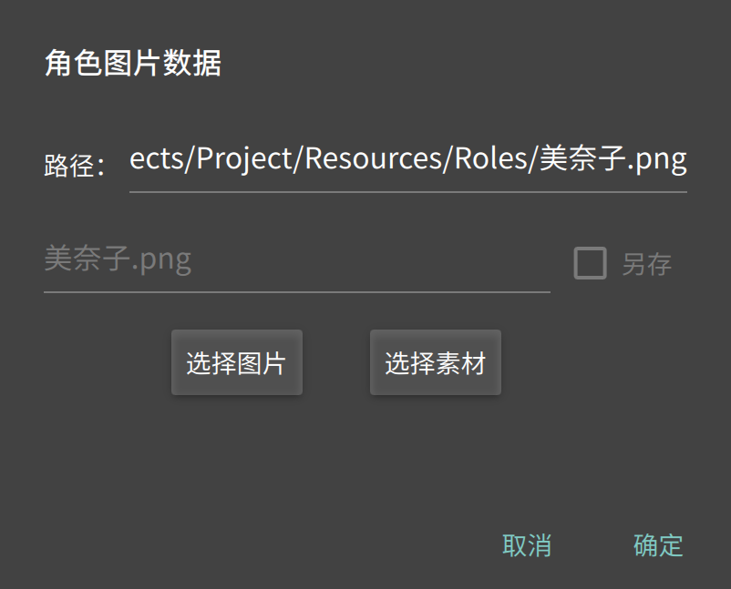
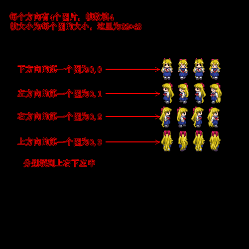

# 前言

&emsp;&emsp;这一节，我们来做一个简单的地图角色，地图角色是我们的主角、NPC和其他物品所使用的资源。

# 一、步骤

&emsp;&emsp;1、准备一张图片，包含等大小的序列帧，图片格式可以是JPG、BMP、PNG等主流格式，推荐PNG格式，因为它具有透明度，效果会更好一些；图片内容可以是单张图或多张连续动作的图，可以用来制作静止、二方向或四方向的行走动画。

&emsp;&emsp;例如：

a、标准的四向行走图（示例1，大小为128*192）

b、标准的二向行走图

c、一个物品图

&emsp;&emsp;2、进入【角色编辑器】，点击【新建角色】，出现角色编辑器界面：

&emsp;&emsp;3、导入图片资源：点击“图片资源”：

&emsp;&emsp;这里“选择图片”是从其他地方选择我们的素材图片并导入，“选择素材”是选择我们之前导入的素材图片，所以第一次我们点击“选择图片”，然后找到图片后点确定。图片导入成功。

&emsp;&emsp;图片导入成功后，在编辑器界面可以点击“原图”来查看图片和图片的大小。

&emsp;&emsp;4、依次设置属性（点帮助可以获取提示）：

* 类型：支持3种类型，分别是”典型行走行列图“（一张图片内有相同大小的帧，包含了上右下左四个方向的集合）、序列图片文件（多张图片切换播放为动画，类似传奇的形式，功能过呢更多，但必须编辑脚本）、从特效选择（每个动作可以从一个特效选择）；
* 移速：角色在地图上的移动速度。这个值单位是 像素/毫秒（为了适应各种刷新率下速度一致），具体要根据图块大小来设置（一般设置为0.1-0.2即可）；
* 可穿透：角色是否可以穿过角色或障碍（0b1为可穿透其他角色，0b10为可穿透障碍）；
* 名字：游戏中显示的名字；
* 显示：角色头顶是否显示名字；
* 头像和大小：使用对话命令的时候，会带有这个头像；
* [影子]偏移和大小：影子表示角色的实际占位，会影响角色到障碍或边界的碰撞，一般斜视地图的效果是将影子放在角色下半身，正视地图的效果是角色全部；
* [影子]透明度：值范围 0~1，阴影程度；
* [角色]偏移和大小：游戏中显示的大小（宽和高），根据你游戏整体风格来设置；
* [角色]X/Y轴缩放：表示在X、Y方向上放大或缩小多少倍，负数表示镜像（反转）；
* [帧]宽高和帧数：将图片切割为每一帧的大小（填错会导致显示效果出问题）；
* [帧]速度：帧切换速度，一般100；
* 上右下左方向：将一张图切割为 m列*n行 个帧，则角色的上、右、下、左的 第一个帧 分别是 哪列哪行（可以理解为x、y坐标，0开始）；
* 编辑脚本：可以编辑角色在游戏中的一些特殊脚本（比如角色动作时的回调；如果角色是”序列图片文件“类型，则必须在这里编辑图片的切换规则）；

&emsp;&emsp;5、如果是二向图或物品图，上右下左可以重复填写为一组或两组值。

# 二、测试

&emsp;&emsp;如果所有的属性填写无错，则下方就会出现角色的效果图，点击图片或使用摇杆可以测试行走情况。

&emsp;&emsp;此时，我们必须点击“保存”，填写角色资源名后，才能将这个资源真正保存供游戏使用。

