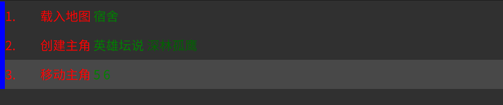
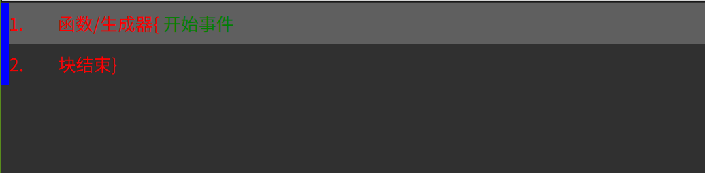
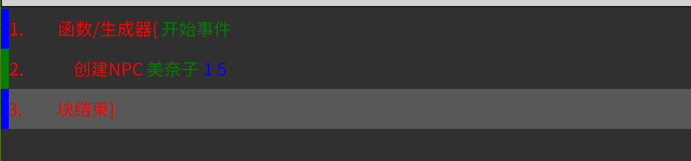
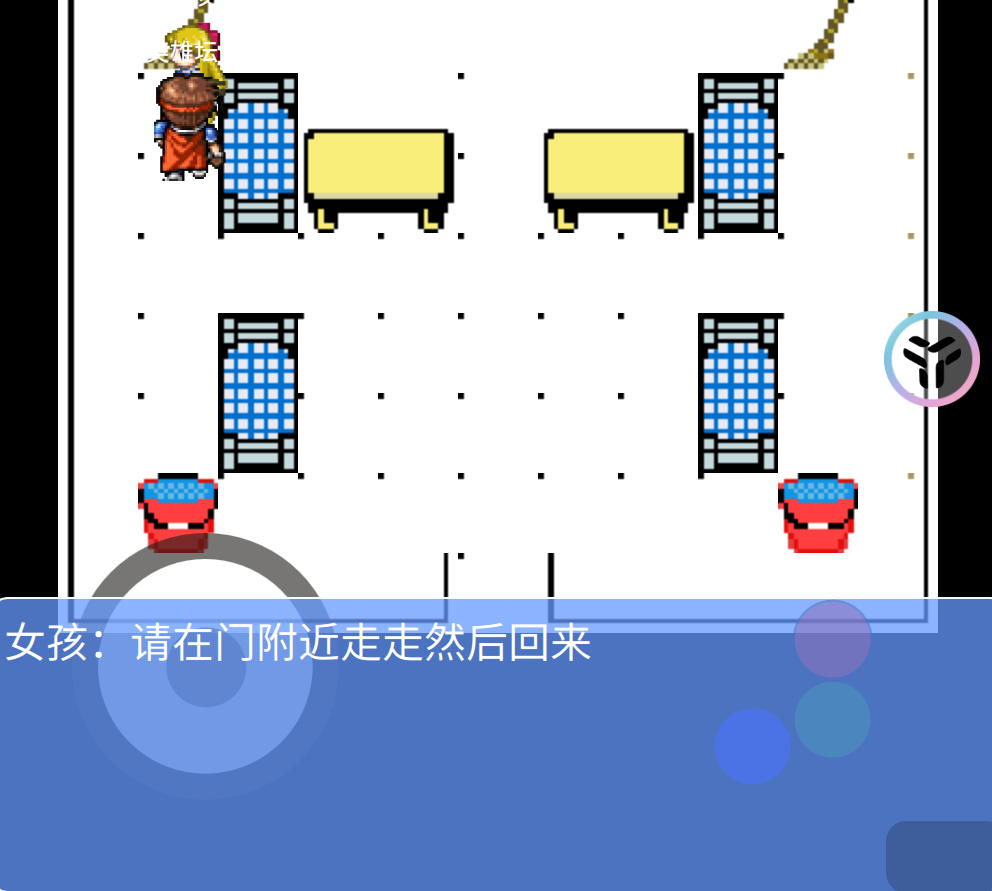
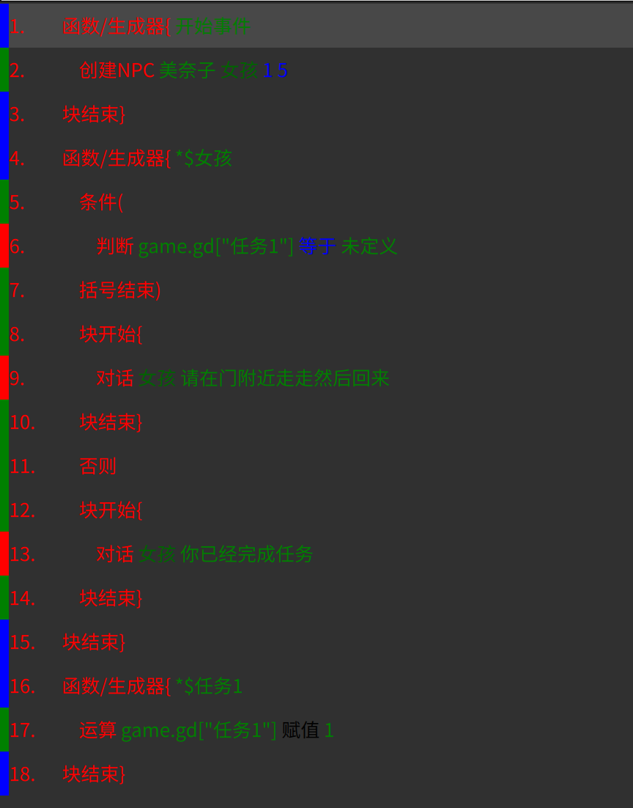

# 前言

&emsp;&emsp;有了角色、地图和简单的视图脚本编程基础，我们就可以做一个简单的游戏了。假设我们已经做好了几个角色和几张地图，接下来我们只需要用视图脚本来做各种事件就行了。

# 一、游戏开始事件

&emsp;&emsp;游戏开始事件（start.js）是点击游戏开始时运行的脚本，是游戏的主入口，系统自带了一个简易的游戏菜单供初学者使用：

&emsp;&emsp;进入引擎主界面，点击”开始游戏“，文本内容便是游戏开始脚本，我们初学者不用写代码，只需点击右上角的”v“即可进入视图编程界面。

&emsp;&emsp;默认的游戏开始脚本只有这两个命令，但是重点来了，如果我们删除了这两个命令，那么系统自带的开始菜单才会显示（此时你的所有命令都会编译放在“开始游戏”功能中），如果保留则不会使用系统自带的开始菜单，这样你可以自己制作游戏开始界面（用地图或各种特效）。在这里我们删除这两个命令（使用系统自带的菜单）。

&emsp;&emsp;首先载入一张地图（也可以先创建主角），点击“命令”、”游戏命令“、“载入地图”，长按“地图名”编辑框，选择一张地图（比如“宿舍”），“确定”，点击“追加”，此时这条命令被编辑好并添加到了命令区中。以后的地图之间的切换（传送）都是使用这个命令来完成的。

&emsp;&emsp;地图载入完成，还得创建一个主角，点击“命令”、“地图角色”、“创建主角”，长按“角色资源名”文本框，选择一个编辑好的角色，“确定”，再给一个角色名，“确定”，点击“追加”。

&emsp;&emsp;角色此时默认在地图的0，0位置处，我们还得把他移动到对应的位置，点击“命令”、“地图角色”、“移动主角”，填入x、y坐标，比如6，6，“确定”，“追加”。

&emsp;&emsp;注意命令的顺序，移动主角必须在创建主角之后，其他的无所谓，用“向上”、“向下”、”插入“、”删除“来修改命令集；双击命令可以修改命令，点击“修改”可以将当前选中的命令修改为 编辑命令栏的命令；点击“单选”可以切换为“多选”，多选状态下可以选择多条命令，然后点击“复制”来复制选择的命令到缓存，再点击粘贴可以将复制的命令复制到命令区的焦点命令处（可以跨脚本）。“保存”是将当前编辑好命令区保存（很重要，多保存），“读取”是将保存的命令数据读取到当前命令区中（注意是替换）；“编译”是将命令区的所有命令集编译为最终代码，编译后才有效果（因为最终引擎是用代码来运行的，视图脚本只是一个编辑器）；“测试”可以测试你的命令集是否有语法错误。

&emsp;&emsp;最终应该是这样：

&emsp;&emsp;返回时会再次提示是否需要保存和编译，此时点击是，则会自动执行“保存”和“编译”。

&emsp;&emsp;返回到游戏开始脚本代码界面，点击“开始游戏”，则会进入游戏：

&emsp;&emsp;点击“开始游戏”：

&emsp;&emsp;默认引擎支持 键盘、摇杆和屏幕点击 来操作游戏。

&emsp;&emsp;这是你做的第一个游戏，很有成就感吧~

# 二、地图事件

&emsp;&emsp;游戏开始事件一般只是用来提供游戏入口，比如游戏界面、开始游戏、载入游戏这些固定的功能，具体的游戏内容是在每一张地图的地图事件里编辑的。

&emsp;&emsp;我们打开地图编辑器，点击“脚本”即可弹出地图脚本编辑器，点击上面的“v”，弹出视图脚本编辑器。默认只有两个命令：

&emsp;&emsp;这里要注意的是，开始事件就是一进入地图要执行的命令，比如创建NPC、定时器等等初始化操作放在这里，和游戏开始脚本不同的是，所有的代码都得写在一个 “函数/生成器”中才可以，写在外面的命令容易出错（因为会优先于所有函数运行，且不支持异步的yield）。

&emsp;&emsp;我们还可以定义其他的 函数/生成器，函数/生成器 的命名有以下规则：

&emsp;&emsp;1、名字前不加\*号的表示是一个函数，函数是一口气执行完毕并返回一个结果；前面加*号的，表示这是一个生成器，专业的讲可以使用yield中途返回，因为鹰歌引擎用的是js语言，js是单线程异步脚本，代码一般都是一口气全部执行完毕的，并不会中途等待某个命令结束，结果都是使用回调函数的方式来通知。鹰歌引擎封装了大量的代码并使用生成器来实现同步执行脚本，一般只需要在支持等待的命令前加一个yield即可实现。**小白无脑使用带\*名字（生成器）即可，且无需其他处理（命令都是默认同步执行的）。**

&emsp;&emsp;2、函数/生成器的名字，如果是 \$事件名，则主角触碰事件区域后会自动触发调用这个函数/生成器，如果是 \$角色id，则和这个角色交互时会自动触发调用。

&emsp;&emsp;3、其他命名（字母、汉字、\$符号开头，字母、汉字、\$符号、数字组成），则可以在这个地图脚本中手动调用执行它。这个就是编程里的模块化，把经常调用的一些命令集做成一个功能块来调用。

&emsp;&emsp;我们这里简单的演示如何做一个事件并保存在全局变量中，相当于领取任务并完成任务。

&emsp;&emsp;1、先做一个NPC和对话的功能。

&emsp;&emsp;我们的游戏开始脚本中载入了“宿舍”地图，我们就在这个地图里做事件和任务。打开这个地图后，进入地图脚本的视图编程界面，因为我们需要一进入地图就产生一个NPC，所以在“开始事件”中创建一个NPC即可，点击“命令”、“地图角色”、“创建NPC”，长按“角色资源名”文本框，选择一个NPC，名字随意写，坐标填1，5，“确定”，“追加”，然后调整命令位置：

&emsp;&emsp;这样我们实现了，一进入地图便有一个NPC在晃悠。但是具体的事件我们还没做，所以上面交互都没有，现在我们开始做交互。

&emsp;&emsp;点击“命令”、“函数/生成器”、“函数/生成器{”，名称那里输入你创建的NPC的名字（注意前面带\*号表示是一个生成器，然后可以再带一个\$号，比如我的是”\*\$女孩“），这样和NPC交互时会自动调用这个函数/生成器。点击”添加“，引擎会添加命令并自动生成”块结束“命令（每个函数/生成器必须要有块结束来闭合）。注意”函数/生成器“之间不要互相包含，它们都是并列定义在脚本中的。

&emsp;&emsp;点击”命令“、”交互“、”对话“，”角色名“填你创建的NPC名字（比如女孩），信息填你要让他说的话（比如我写的是：请在门附近走走然后回来），其他默认（可以修改信息显示效果），然后”确定“，”插入“，将命令添加在命令区中。调整命令顺序如下：

&emsp;&emsp;测试以下效果，走在女孩身边后点红色按钮或键盘enter键：

&emsp;&emsp;2、目前我们每次和她对话都是这句话，如果需要根据剧情显示不同的对话，需要用到判断语句和全局变量，全局变量（其实就是game.gd）的意思是所有的地图都可以访问，且会存档读档时会自动保存和读取，而局部变量只是在当前地图中有效，换地图便会清空，所以可以临时使用。变量名可以是任何字母、中文和\$开头，字母、中文、数字和\$组成的单词（其实就是JS的对象的一个属性），记住，没有定义过的变量的值都是undefined。我们来做一个简单的任务来展示全局变量和判断语句的用法（判断语句是一个游戏的主要逻辑，会大量用到）。

&emsp;&emsp;点击“命令”、“条件”、“条件(”，添加命令到“女孩”生成器中。此时会生成4条命令。

&emsp;&emsp;点击“命令”、“运算”、“判断”，长按 变量文本框，选择全局变量，然后将“变量1”修改为你需要的变量名，比如我这里改为game.gd["任务1"]；长按 符号文本框，选择“等于”；长按 值/变量 文本框，选择“未定义”，添加命令到“条件(”命令下面。这里的意思是，如果全局变量没有定义，则会运行下面的代码块。

&emsp;&emsp;点击“命令”、“条件”、”否则“，添加到”条件命令“的”块结束“下面，此时会生成3条命令。

&emsp;&emsp;再添加一条”对话“命令到上调命令生成的块中。

&emsp;&emsp;这个时候NPC的事件我们做完了，还得做一个完成任务的事件，我们用地图事件去实现它，返回到地图编辑器界面，添加一个地图事件，事件名为：任务1，并绘制在相应位置：

&emsp;&emsp;再进入地图脚本的视图编程界面，添加一个”\*\$任务1“的函数/生成器。

&emsp;&emsp;点击”命令“、”运算“、”运算“，长按 变量1 文本框，选择”全局变量“，改为game.gd["任务1"]，长按 符号 文本框，选择”赋值“，变量2 文本框填1，添加这个命令到”\*\$任务1“的函数/生成器中。

&emsp;&emsp;调整命令顺序，结果如下：

&emsp;&emsp;大体解释一下：我们直接和NPC对话，因为”任务1“的全局变量没有定义过，所以程序会判断并执行”请在门附近走走然后回来的“对话，如果主角在地图下方的事件中走走，会触发”任务1“的代码，此时将”任务1“全局变量设置为了1，所以再次和NPC对话会从”否则“的逻辑走，也就是”你已经完成任务“的对话。很简单吧？

&emsp;&emsp;这只是可视化中非常简单、最常用的命令和结构，其他的命令也类似的去填参数、添加，用这些命令组合来实现非常强大的逻辑和功能，比如战斗、特效等都能实现。后期我们再慢慢介绍。

# 三、其他说明

&emsp;&emsp;游戏的存档功能是全自动的，主角当前的地图、位置，缩放大小、背景音乐等等都是自动保存的，还有一个很重要的数据是全局变量（game.gd），它是所有地图脚本都可以访问的，也是自动保存的，所以所有的事件、数据都可以保存在里面，下次读取时会自动恢复。相对应的还有地图变量，它是一个地图中可用的，切换地图便会清空，可以做临时变量用；另外就是JS语言中的普通变量，用let或var定义，**小白无脑使用全局变量和地图变量即可。**
