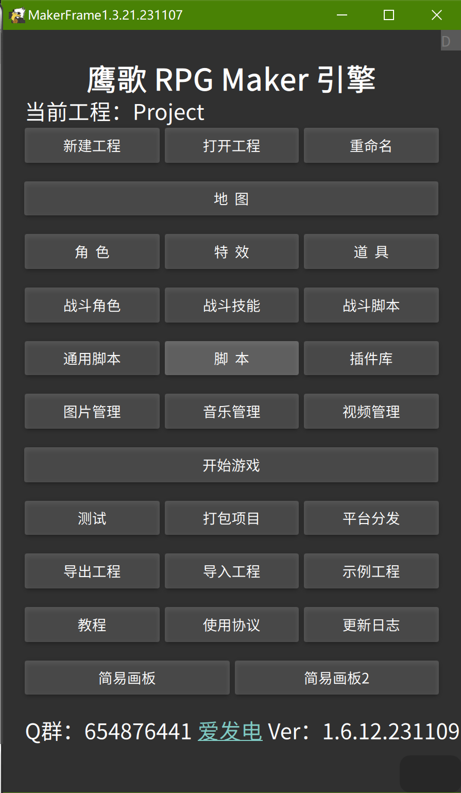

# 1、工程

* 我们每一个游戏项目都是一个工程，上方的“当前工程”和三个按钮是管理工程的。
* “导出工程”和“导入工程”，可以将项目打包为zip文件进行移动、分享。
* “打包项目”（目前只有安卓有）可以将工程与运行环境整合为一个APK目录，再用相关软件打包为APK就可以发布了。

# 2、游戏场景

&emsp;&emsp;游戏一共有两个场景，一个是地图场景，地图上的主角和NPC在上面行走、触发事件等等；一个是战斗场景，我方和地方进行回合制战斗；

&emsp;&emsp;注意：角色和战斗角色是两个概念，角色显示在地图场景中的，而战斗角色是显示在战斗场景中的。有一个主角不一定就有我方战斗角色，也可以有多个我方战斗角色，这是分开操作的。

# 3、编辑器

* 地图编辑器：顾名思义，编辑地图与地图事件的。
* 角色编辑器：用来编辑主角、NPC等地图上的角色。
* 特效编辑器：所有的动画都是从特效编辑器里制作的，包括角色的动作、战斗角色的动作、显示的特效等等。
* 道具编辑器：游戏道具的编辑。
* 战斗角色编辑器：我方和敌人的战斗角色编辑。
* 战斗技能编辑器：所有的战斗技能编辑。
* 战斗脚本编辑器：每场战斗控制的脚本编辑。
* 开始游戏：进去后可以编辑开始游戏脚本。

### 注意：

* 小白只需要玩转上面的编辑器即可，代码脚本先别碰，这是属于中高级内容。
* 所有脚本编辑界面都有“V”按钮，点击后可进入视图脚本编辑器。
* 上面的地图编辑器、道具编辑器和三个战斗编辑器，都提供了代码脚本和视图脚本两种方式，小白目前只需学会视图脚本编辑即可，简单方便也涵盖了大部分的基本功能，等以后熟悉了代码，可以无限制的拓展任何你能想象到的功能。

# 4、资源管理器

&emsp;&emsp;资源管理器包括 图片管理、音乐管理、视频管理，这三种多媒体是在游戏中使用的，加入后会将对应资源复制到项目中。

# 5、熟悉游戏引擎

&emsp;&emsp;一般来说，小白熟悉引擎应该从这几个步骤入手：

* 用地图编辑器做一张地图；
* 用角色编辑器做一个角色，然后在“测试”中可以将角色放入地图中行走；
* 用视图脚本编辑器编辑一个简单的开始游戏脚本，载入一张地图和创建一个主角，播放一个背景音乐等等；
* 再做一张地图，用 地图编辑器 编辑地图事件，做一个地图间传送；
* 再做一个角色，创建为NPC，用 地图编辑器 中的 视图脚本编辑 来做一个对话功能；
* 学会其他常用的 视图脚本命令，比如变量、逻辑、消息框等，这样地图场景的差不多就学完了，可以做一些简单的文字、解密游戏；
* 做一些战斗相关特效（包括战斗角色特效、技能特效），一个战斗角色、战斗技能和战斗脚本，在游戏中创建战斗；
* 做一些道具，在游戏中的地图场景中使用和装备这些道具。
* 做一些战斗道具，可以在战斗场景中使用道具来施展技能。
* 到此，引擎的基本就可以掌握了，剩下就是慢慢组合这些东西，加上你丰富的剧情和想象力来开发一款好玩的游戏吧。

# 6、注意事项：

&emsp;&emsp;在使用编辑器中，有一些地方需要注意：

* 引擎几乎所有的地方都需要手动保存，并不是自动保存，所以需要注意。
* 文本框前的提示文字，如果带*号，表示必填，如果带@符号，表示可以长按选择。
* 鹰歌的所有编辑器，点保存的时候输入可以另一个名称，就可以实现另存为了。

# 7、其他说明

&emsp;&emsp;有人好奇为什么要用鹰歌来制作游戏，我用Unity、Cocos等的不香吗？

&emsp;&emsp;作者：如果会用Unity、Cocos那还用啥鹰歌，而且我还会推荐你去用Godot、RPG Maker等等，那些都是优秀且完善的引擎了，而鹰歌只是一个个人作品，我推荐它只是因为：

* 面向小白或手机用户；鹰歌非常适合小白，尤其是一点技术都没但游戏创意满满的人，快到碗里来吧~手机上引擎不多，所以我个人还是非常推荐鹰歌的。
* 你做出的游戏工程，可以在电脑、手机上通用，引擎已经自动帮你屏幕自适应了；你导出的游戏，可以很容易的打包发布到Steam和Tap上。
* 鹰歌除了小白容易使用外，技术能力不同的人也很适合：除了视图编辑来制作游戏，有点编程能力的人可以修改或写代码来扩展游戏功能，而更厉害的大神可以脱离引擎来创作游戏（比如用Box2D引擎、Bancon2D引擎、opengl或原生QML，还可以用QML3D来开发3D游戏，这些鹰歌都有提供），甚至还可以重新开发另一个引擎。
* 鹰歌还有其他优势，之前说了，引擎只是框架的一个应用，框架还提供了很多基础功能，比如跨平台、屏幕自适应、网络、热更新、数据库、文件管理、三方SDK等，可以用来开发播放器、浏览器、其他系统类应用APP等。
* 其他的优势、特点可参见引擎内的“关于”。
