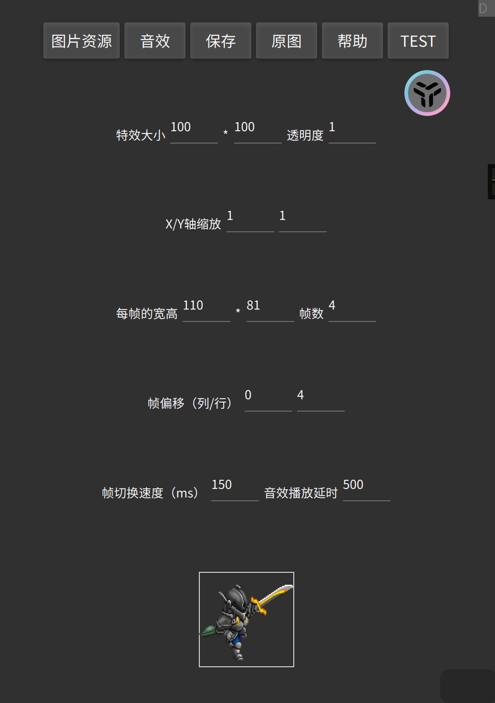
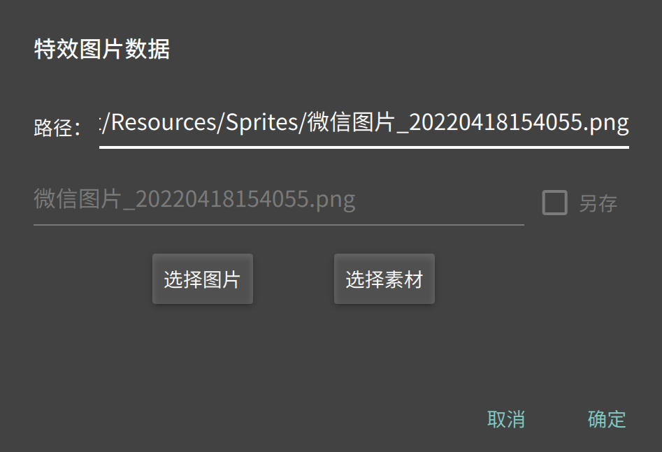

# 前言

&emsp;&emsp;特效是一张大图片切割成等大小帧来序列播放的一组图片。特效用在地图人物的动作、技能效果和战斗人物的动作，也可以单独在地图场景播放。

# 一、步骤

&emsp;&emsp;1、类似角色，需要准备一张图片，包含等大小的序列帧，图片格式可以是JPG、BMP、PNG等主流格式，推荐PNG格式，因为它具有透明度，效果会更好一些。

&emsp;&emsp;例如：一个战斗人物的攻击特效图：

&emsp;&emsp;2、进入【特效编辑器】，点击【新建特效】，出现特效编辑器界面：

&emsp;&emsp;3、导入图片资源：点击“图片资源”：

&emsp;&emsp;这里“选择图片”是从其他地方选择我们的素材图片并导入，“选择素材”是选择我们之前导入的素材图片，所以第一次我们点击“选择图片”，然后找到图片后点确定。图片导入成功。

&emsp;&emsp;图片导入成功后，在编辑器界面可以点击“原图”来查看图片和图片的大小。

&emsp;&emsp;4、选择音效

&emsp;&emsp;如果特效有声音，则可以播放一个音效，点击“音效”按钮，添加或选择音效资源即可；

&emsp;&emsp;5、依次设置属性（点帮助可以获取提示）：

* 特效大小：游戏中显示的大小（宽和高），根据你游戏整体风格来设置；
* X/Y轴缩放：表示在X、Y方向上放大或缩小多少倍，负数表示镜像（反转）；一般默认我们都填1；

* 透明度：值范围 0~1，特效的透明程度；
* 帧宽高：将图片切割为每一帧的大小（填错会导致显示效果出问题）；

比如图片的大小是128\*192，分别有4行4列，那么它一帧的宽高就是32*48。

* 帧数：特效一共有多少帧；
* 帧偏移：帧的开头从哪一帧开始播放；

* 帧切换速度：你懂的，一般我填100；
* 音效延迟播放：如果选择了音效，则特效播放多久后才播放音效；

# 二、测试

&emsp;&emsp;如果所有的属性填写无错，则下方就会出现特效的效果图，点击图片可以测试。

&emsp;&emsp;此时，我们必须点击“保存”，填写特效名后，才能将这个资源真正保存到特效中。
