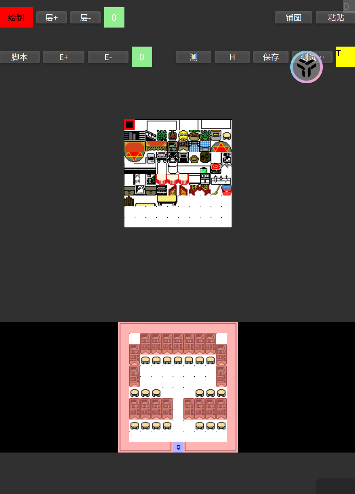

# 前言

&emsp;&emsp;顾名思义，地图是非常重要的游戏元素之一，精美的地图可以让玩家引人入胜。一张地图的大小是有限的（无限地图是用特定的算法实现的，鹰歌也可以做到），多张地图的切换应该和剧情的发展有机的结合在一起。

&emsp;&emsp;鹰歌引擎的地图大小虽然没限制大小，但是为了跨平台的考虑（每个平台、架构能呈现的像素不同、绘制速度也不同）还是建议玩家自行限制（如果超出环境限制范围，会大量报错或出现无法绘制等问题）；地图如果大于视窗，则视窗会跟随主角进行移动地图，保持主角在视窗内，如果小于视窗，则居中在视窗内。

&emsp;&emsp;地图绘制是体力活，这里多讲一些绘制方面的技巧。

# 一、编辑地图参数

&emsp;&emsp;进入鹰歌RPG引擎主界面，点击“地图”便可进入地图编辑器，此时会显示“新建地图”和已经绘制好的地图资源，我们点击“新建地图”：

&emsp;&emsp;我们可以添加地图的图片（选择图片）或选择已添加的地图图片（选择素材），然后在地图快大小中指定我们的地图图片素材的地图块大小（一般16\*16*和32\*32的居多，地图块大小也决定了障碍、事件格子的大小），然后填入我们地图的大小（单位是地图块），所以整个地图的像素大小是 它们的乘积。

&emsp;&emsp;如果我们选择已经做好的地图资源，也会弹出这个对话框，此时我们可以对已做好的地图的属性进行修改，比如修改地图大小（不建议修改地图块大小和图片资源，会造成会乱）。

# 二、界面

&emsp;&emsp;进入绘制界面后（很丑，以后美化），上方是功能区，中间部分是地图块选区，下方是绘制区域。

&emsp;&emsp;由于兼顾跨平台特性（鼠标和手势等），目前绘制体验很一般，以后有时间针对各平台优化，并兼容tiled数据。

&emsp;&emsp;左上角第一个按钮是操作类型，单击后分别会在“绘制”、“障碍”、“事件”、“移动”中切换，分别代表了在绘制区域操作时的功能。

&emsp;&emsp;层+、层-及滑动块区域：增加或删除地图层。滑动区域可以左右滑动显示更多的地图层块（绿色块代表当前层）。单击地图层块后可以选择当前地图层，双击可以切换 显示/半透明/隐藏 当前地图层，绘制时要注意你绘制的地图层在哪一层，高层会覆盖低层的图块，可以做层次效果（比如房屋、大树可以挡住角色），一般情况下有2-4层就足够了，1-2层作为地板层，保存地图时可以指定地板层是第几层。

&emsp;&emsp;铺图：将地图块图片整体平铺绘制在当前地图层，这个功能非常有用，如果你有成品地图图片，直接用它就可以生成地图资源，不必再一一绘制。

&emsp;&emsp;粘贴：当地图绘制区域有复制选区时，单击它可以将复制的选区复制到当前图层的焦点位置上。

&emsp;&emsp;脚本：进入地图脚本编辑（包括视图编程）。

&emsp;&emsp;E+、E-及滑动区域：增加或删除事件。滑动区域可以左右滑动显示更多的事件块。单击事件块后可以选择当前事件，双击事件块可以修改事件名，操作类型选为“事件”便可以将当前事件绘制到绘制区域了。

&emsp;&emsp;H：帮助。

&emsp;&emsp;测试：测试当前地图效果（包括脚本）；

&emsp;&emsp;保存：输入 地图名、地图缩放倍数和地板层，确定后即可保存（或另存为）。地图名就是以后游戏中引用的地图资源名；地图缩放表示显示地图时按原来多少倍数显示（地图块也相应的变化了）；地板层表示角色遮挡地图层的最大层是多少。

# 三、绘制地图

&emsp;&emsp;我们把操作类型选为“绘制”，然后点击中间的图块资源的某一块，单击+拖动便可以在绘制区域进行绘制了；

&emsp;&emsp;操作类型选为“障碍”，然后单击+拖动在绘制区域进行绘制障碍了（红色）；

&emsp;&emsp;操作类型选为“事件”，然后在事件区域中点击某个事件块，单击+拖动便可以在绘制区域进行事件绘制了（蓝色）；

&emsp;&emsp;上面三种操作，如果需要清除，则双击左键（手机上是双击）并拖动便可以清除已绘制的。

&emsp;&emsp;复制：在上面三种操作类型下，点击+长按，会出现绿色方块，此时拖动便可以选择需要复制的区域（注意是当前图层下），然后选择需要复制的图层后点击需要复制的地方，再点击“粘贴”便可完成粘贴操作；

&emsp;&emsp;操作类型选为“移动”，此时鼠标或手势操作便可以在绘制区域进行拖动和缩放（鼠标可以用中键进行缩放）。

&emsp;&emsp;地图编辑器大致内容就这么多，设计到的地图事件和脚本以后再讲。
