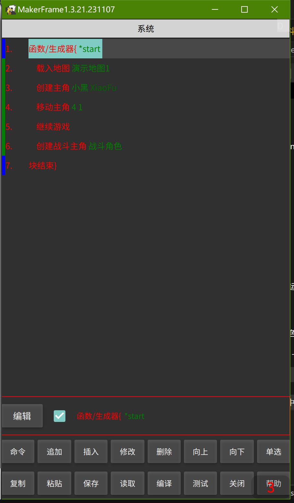

# 前言

&emsp;&emsp;视图脚本，也叫可视化编程，或者叫模块编程，意思是不用写代码，直接利用已有的模块修改一些参数后组装而成。

&emsp;&emsp;视图脚本可能是可视化引擎里最难的部分，但相比编写代码还是容易的多，只要把每个视图脚本的命令过一遍，有一点逻辑思维还是很容易做出丰富的功能和玩法。

&emsp;&emsp;视图脚本对小白来说可以在三个地方编辑：开始游戏脚本、地图脚本和升级连脚本（插件形式提供）。

&emsp;&emsp;说明几点：

&emsp;&emsp;1、在脚本编辑的代码区域，有“v”的按钮就是代表进入视图编辑界面；

&emsp;&emsp;2、视图编辑完成后，记得要点“保存”来保存当前的视图编辑数据，点“编译”将视图脚本转换为代码（视图脚本的核心就是自动生成代码）；

&emsp;&emsp;3、返回到代码编辑区域后，也需要点击”保存“一下，将生成的代码保存；

&emsp;&emsp;4、如果不懂代码，尽量不要去修改，否则很容易报错；

# 一、视图脚本编辑器的位置

&emsp;&emsp;开始游戏脚本的编辑器在“主界面”-》“开始游戏”的地方；

&emsp;&emsp;地图脚本编辑器在”地图编辑器“-》地图-》”脚本“的地方；

&emsp;&emsp;升级连脚本编辑器，首先进入”插件库“，下载”升级连脚本“，然后在”主界面“-》”脚本编辑器“-》”选择文件“-》level_chain.js 文件；

# 二、视图脚本编辑器界面

标题（系统）：命令集的名字，如果下载了其他的命令集则可以选择（选择新命令集会清空已有的命令）；

命令区：显示我们的所有添加好的脚本命令集；

编辑栏：从“命令”中选择的命令、双击命令都可以将命令放在编辑栏中供编辑和添加；点击“编辑”可以编辑当前的命令参数；取消勾选可以暂时让当前指令失效（注释）；点击“追加”、“插入”、“修改”按钮分别做到将编辑栏缓存的命令追加（在最后）、插入在当前命令焦点之前）、替换当前焦点命令的功能。

命令：选择一个视图脚本命令，编辑参数后放在编辑栏中；

追加：将编辑栏中的命令追加到命令区最底部；

插入：将编辑栏中的命令插入到当前命令区选择的焦点命令的上面；

修改：将编辑栏中的命令替换到当前命令区的焦点命令；

删除：删除当前选择的焦点命令；

向上、向下：移动当前选择的焦点命令；

保存、读取：保存或读取当前视图脚本数据；注意退出时一定要保存，否则数据会丢失；

编译：将当前视图脚本编译为代码格式，此时返回上一层就可以看到代码区；这里要记得编译，否则当前编辑好的视图脚本不生效；

编辑或双击命令：编辑命令的参数；

# 三、视图脚本的注意事项

&emsp;&emsp;一般情况下，我们的所有的命令都得写在一个叫”函数/生成器“的命令块里，不同的”函数/生成器“有不同的作用，比如 *start 表示载入时调用，*init 表示 游戏脚本中初始化时调用等等，其他的名字我们可以自己取，自己取的 函数/生成器，我们自己可以调用，在这篇教程里我们只关心 *start。

# 四、在开始游戏脚本中使用命令

&emsp;&emsp;我们打开 开始游戏脚本视图编辑器 后，默认就会产生 *start 的函数/生成器 和 块结束 两个命令（如果没有，则可以手动添加一下），此时：

&emsp;&emsp;1、我们点击  命令-》游戏命令-》载入地图，然后长按”地图名“编辑栏，选择一个地图，点”确定“，然后点”插入“；

&emsp;&emsp;2、点击 命令-》地图角色-》创建主角，长按”角色资源名“编辑栏，选择一个角色，点”确定“，然后点”插入“；

&emsp;&emsp;3、点击 命令-》地图角色-》移动主角，输入要移动的x、y坐标，点”确定“，然后点”插入“；

&emsp;&emsp;4、点击 命令-》游戏命令-》继续游戏，点”确定“，然后点”插入“；

&emsp;&emsp;5、调整命令顺序，格式见下图；

&emsp;&emsp;6、点击 ”保存“，点击”编译“，然后返回到代码界面，点 开始游戏（点击才保存代码），就可以看到我们的命令正常运行了；

