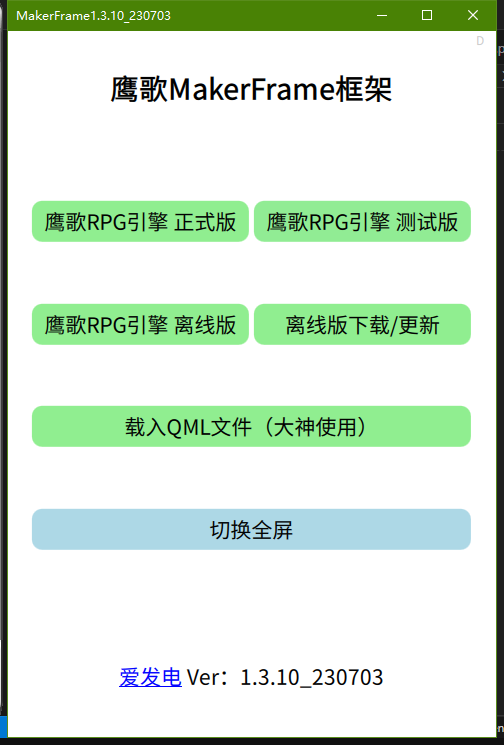
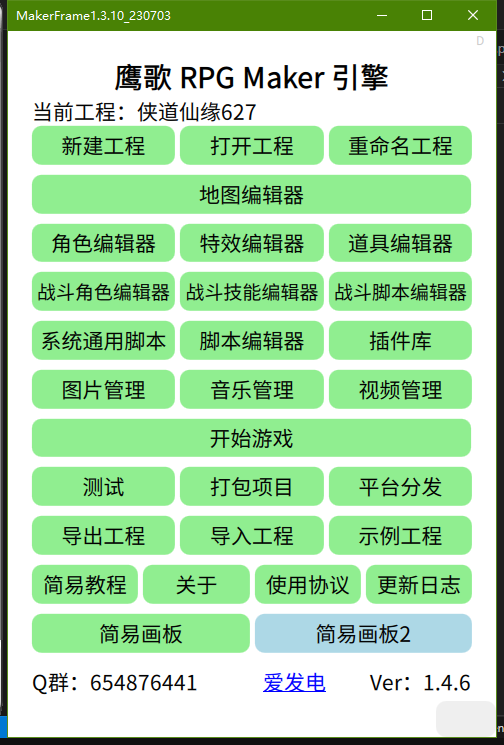

# 前言

&emsp;&emsp;欢迎使用鹰歌框架之鹰歌RPG引擎+Maker，在这里我首先会把你当作一个小白，一步步教你如何用这个应用来最简单、快速的创作一个RPG游戏。

# 准备

* 一部安卓手机或电脑
* 鹰歌框架软件（安卓或电脑版）
* 细心、耐心和恒心

# 一、安装

&emsp;&emsp;这个我就不多说了，注意的是鹰歌处于快速迭代期，尽量使用最新版来体验最新的功能。另外，除了内核一般很少升级外，引擎大部分都是自己热更新的，不需要你来手动下载更新（很方便吧？）。

# 二、运行

&emsp;&emsp;如果安装成功并运行（界面虽丑但功能强大，不要被外表所欺骗~），会出现第一个界面：鹰歌框架主界面

&emsp;&emsp;小白可以无脑选择第一项：鹰歌RPG引擎 离线版

Tips：

* 引擎是框架的一个应用，如果是高手可以自己制作引擎，然后用“载入QML文件”来调用；
* 在线版是需要联网的，使用的是最新的版本；离线版下载后可以离线使用，一般是稳定版本；
* 下面的版本号是框架版本；

# 三、进入引擎主界面

  

Tips：

* 点击“示例工程”可以下载官方自带Demo工程，点“开始游戏”进行游戏；
* 可以从群文件下载项目，然后点“导入工程”可以将项目倒入引擎中，点“开始游戏”进行游戏；
* 下面的版本是引擎版本；
