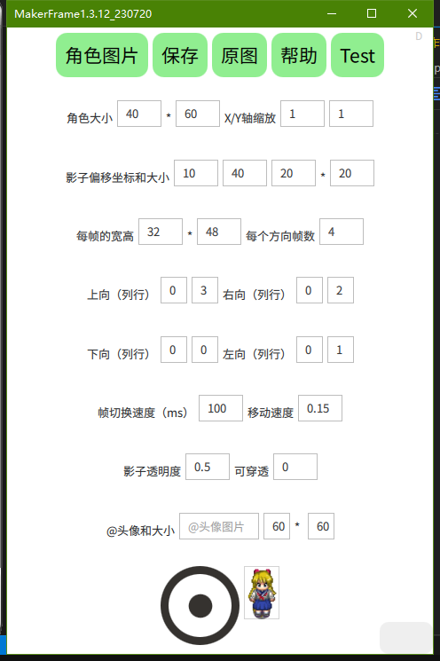

# 前言

&emsp;&emsp;这一节，我们来做一个简单的地图角色，地图角色是我们的主角、NPC和其他物品所使用的资源。

# 一、步骤

&emsp;&emsp;1、准备一张图片，图片格式可以是JPG、BMP、PNG等主流格式，推荐PNG格式，因为它具有透明度，效果会更好一些；图片内容可以是单张图或多张连续动作的图，可以用来制作静止、二方向或四方向的行走动画。

&emsp;&emsp;例如：

a、标准的四向行走图（示例1，大小为128*192）

b、标准的二向行走图

c、一个物品图

&emsp;&emsp;2、进入【角色编辑器】，点击【新建角色】，出现角色编辑器界面：

&emsp;&emsp;3、导入图片资源：点击“角色图片”：

&emsp;&emsp;这里“选择图片”是从其他地方选择我们的素材图片并导入，“选择素材”是选择我们之前导入的素材图片，所以第一次我们点击“选择图片”，然后找到图片后点确定。图片导入成功。

&emsp;&emsp;图片导入成功后，在编辑器界面可以点击“原图”来查看图片和图片的大小。

&emsp;&emsp;4、依次设置角色的属性（点帮助可以获取提示）：

&emsp;&emsp;a、角色大小：游戏中显示的大小（宽和高），根据你游戏整体风格来设置；

&emsp;&emsp;b、X/Y轴缩放：表示在X、Y方向上放大或缩小多少倍，负数表示镜像（反转）；一般默认我们都填1；

&emsp;&emsp;c、影子偏移坐标和大小：影子表示角色的实际占位，会影响角色到障碍或边界的碰撞，一般斜视地图的效果是将影子放在角色下半身，正视地图的效果是角色全部；

如果是示例1，我们填10、40、20、20就可以将影子放在脚下，影子透明度为0.3，效果会非常好。

&emsp;&emsp;d、每帧的宽高：将图片切割为每一帧的大小（填错会导致显示效果出问题）；

示例1的大小是128\*192，分别有4行4列，那么它一帧的宽高就是32*48。

&emsp;&emsp;e、上右下左：将一张图切割为 m列*n行 个帧，则角色的上、右、下、左的 第一个帧 分别是 哪列哪行（可以理解为x、y坐标，0开始）；

示例1中，我们角色的向上的起始帧是第0列第3行，所以上填0和3，向右的起始帧是第0列第2行，所以填0和2，以此类推。

&emsp;&emsp;f、帧切换速度：你懂的，一般我填100；

&emsp;&emsp;g、移动速度：角色在地图上的移动速度。这个值单位是 像素/毫秒（为了适应各种刷新率下速度一致），具体要根据图块大小来设置（一般设置为0.1-0.2即可）；

&emsp;&emsp;h、影子透明度：值范围 0~1，阴影程度；

&emsp;&emsp;i、可穿透：角色是否可以穿过；

&emsp;&emsp;j、头像和大小：使用对话命令的时候，会带有这个头像；头像可以长按选择图片。

&emsp;&emsp;5、如果是二向图或物品图，上右下左可以重复填写为一组或两组值。

# 二、测试

&emsp;&emsp;如果所有的属性填写无错，则下方就会出现角色的效果图，点击图片或使用摇杆可以测试行走情况。

&emsp;&emsp;此时，我们必须点击“保存”，填写角色名后，才能将这个资源真正保存到角色中。
