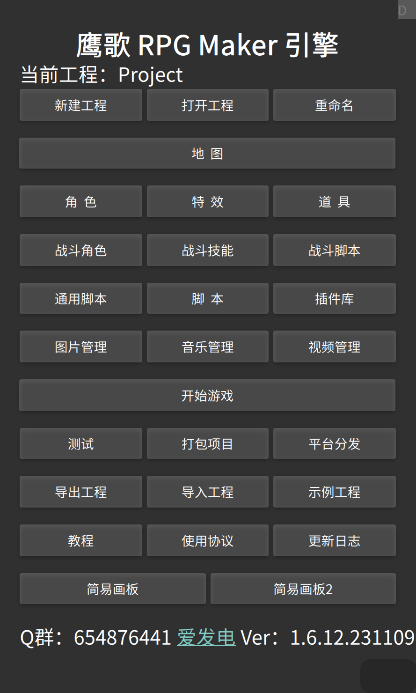

# 前言

&emsp;&emsp;这是高级进阶教程，看到这里的朋友首先必须要有Javascript编程经验基础，如果会QML的话会更好。

# 一、框架架构

&emsp;&emsp;鹰歌框架是一款使用Qt+QML、使用C++、Javascript、Java编写的App，非H5核心（但内置H5浏览器），最底层是用Qt/C++、Java编写，用来提供系统平台特定功能、网络、数据库、热更新、跨平台、压缩、加解密等底层功能，所以叫“框架”，而引擎部分基本是纯QML编写，是由RPG游戏运行环境+编辑器组成，运行在框架之上，所以鹰歌框架下可以做多个引擎或游戏，目前鹰歌已经集成了RPG、Bacon2d、Box2d这三种引擎和多个扩展（qnanopainter、quazip等），开发者可任选一种引擎进行开发，也可脱离引擎使用QML来原生开发。

&emsp;&emsp;目前鹰歌已适配到windows、安卓、Linux（Debian、Ubuntu、openKylin等）、MacOS、IOS平台，工程通用，真正做到本地化跨平台。

# 二、RPG引擎架构

&emsp;&emsp;RPG引擎，从不同角度讲有不同的东西，总体来说，也就是1个地图编辑器，2种编码方式，3块脚本，4个对象：

* 从界面角度讲，有2个界面，一个是地图界面，一个是战斗界面，地图界面包含了丰富的组件（比如信息框、对话框、选择框、输入框和地图、视窗、角色等系统组件）和功能，战斗界面也有组件（比如信息框、选择框和战斗人物组件、血条等）和功能；一般地图界面的系统命令是以game开头的，而地图界面的系统命令是以fight开头的。
* 从编辑器角度讲，一共有地图、角色、特效、道具、战斗角色、战斗技能、战斗脚本、通用脚本、图片、音乐、视频这几个大类。其中“特效”做出的东西会在角色、战斗角色、战斗技能中使用到。
* 从游戏脚本对象角度讲，游戏一共有4种脚本对象（其他的编辑器做出的是json数据）：战斗角色、战斗技能、道具和战斗脚本。
  这个东西非常重要，因为涉及到游戏的自定义和存档的保存（只有战斗角色、战斗技能和道具会保存）。
  这4个脚本对象的共同点，就是都包含一个\$createData函数和\$commons对象，$commons对象就是所有创建的对象所共有的属性，比如你想做一种道具，它的属性都是固定的，它不会保存到存档中，只是游戏启动时加载，那么你可以把属性写在\$commons里，如果你想做一种道具，它的属性是有可能变化的，那么你可以写在\$createData里，它创建的属性都会保存到存档中，如果两个地方都有相同的属性，那么以\$createData创建的属性为先。
  两种方案可以混用，比如一个道具的一些数据可以写在\$createData中，而道具描述\$description写在\$commons中，这样好处既能减少存档大小，而且以后修改描述直接修改脚本对象即可，否则保存在存档里就不好改了。
* 从游戏逻辑脚本角度讲，游戏逻辑脚本有3个地方：游戏起始脚本（start.js）、地图脚本（map.js）和通用脚本（common_script）.js。
  游戏起始脚本是游戏载入后的入口文件，start是入口函数，所有的游戏初始化可以写在这里。

  通用脚本是可高度自定义游戏界面、运行机制等的一些配置和函数（比如战场设置、按钮、摇杆大小、Buff种类和功能等等等非常丰富的配置）。
* 地图脚本对应每个地图载入后使用的脚本，start是入口函数（载入地图后运行），其他的函数不同名字都有特定的功能，也可以自己定义函数去调用。
* 从游戏资源的角度讲，有Images（图片）、Maps（地图）、Music（音乐）、Roles（角色）、Sounds（音效）、Sprite（特效）、Video（视频）几种。

# 三、进入引擎主界面

  

Tips：

* 点击“示例工程”可以下载官方自带Demo工程，点“开始游戏”进行游戏；
* 可以从群文件下载项目，然后点“导入工程”可以将项目倒入引擎中，点“开始游戏”进行游戏；
* 下面的版本是RPG引擎版本；
